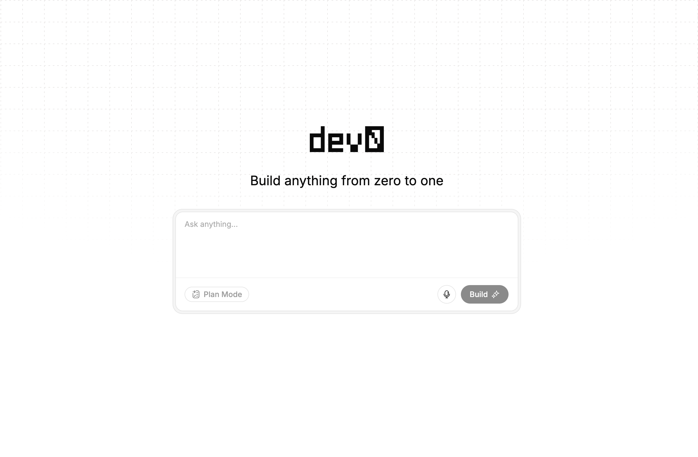
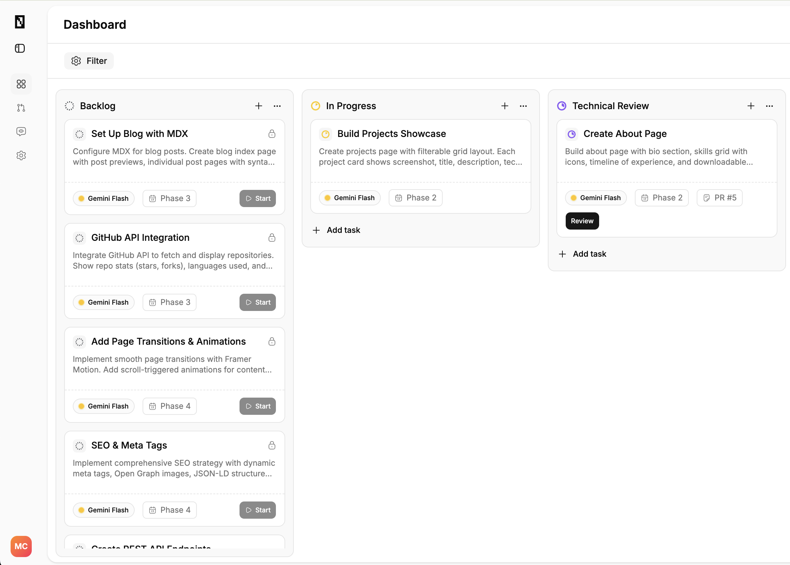
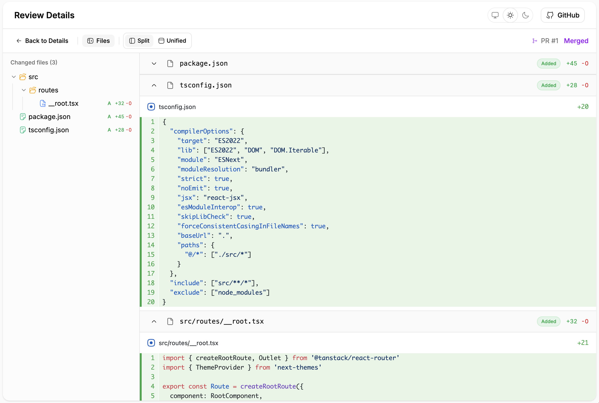
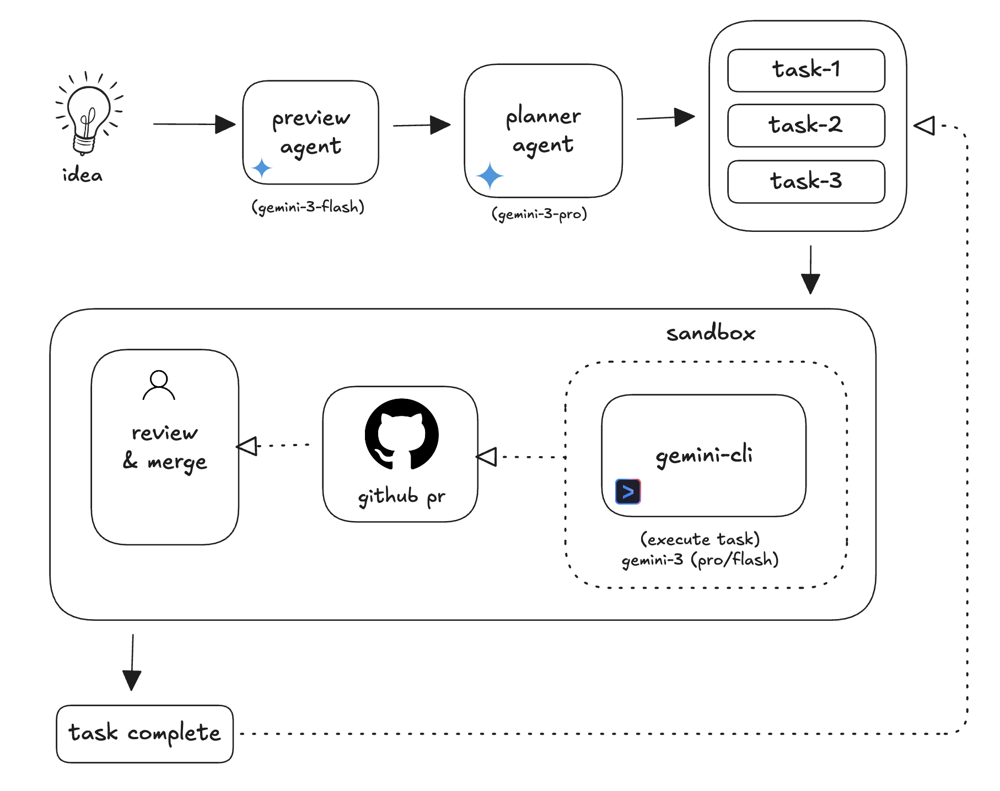

<p align="center">
  
</p>

<h1 align="center">Dev0</h1>

<p align="center">
  <em>The agentic engineering platform for shipping PRs with Gemini 3</em>
</p>

<p align="center">
  
  
  
  
  
  
  
</p>

<p align="center" style="background:white">
  
</p>

Dev0 is an agentic engineering platform inspired by the Ralph loop: let a code agent run until the task is actually done, but keep it contained, auditable, and reviewable. You provide a product idea, Dev0 plans the work, executes tasks in secure environments, and ships each task as a GitHub pull request. Engineers stay in control as technical leads while the platform handles execution.


<br/>
<p align="center">
  
</p>

<p align="center">
  
</p>

<p align="center">
  
</p>

## Key Differentiators

- **Platform-controlled autonomy**: agents run inside E2B sandboxes with strict orchestration and guardrails.
- **PR-first workflow**: every task ends with a reviewable GitHub pull request.
- **Real-time execution visibility**: live task logs and status updates via Upstash Realtime.
- **Gemini CLI in isolation**: YOLO-mode agent execution is contained and reproducible.
- **Human-in-the-loop**: you approve, request changes, or merge from a mission control UI.

## Architecture

- **Frontend**: TanStack Start (React 19, TanStack Router) with Tailwind + shadcn/ui
- **Backend**: TanStack Start server actions + Drizzle ORM
- **AI**: Gemini 3 Pro (planning) and Gemini 3 Flash (execution)
- **Sandbox**: Isolated sandbox environments running Gemini CLI
- **Realtime**: Pub/sub streaming for logs and status
- **Database**: PostgreSQL

<p align="center">
  
</p>

## How It Works

1. **Idea → Preview**: Gemini 3 Flash turns a vibe into name, summary, and stack.
2. **Plan → Tasks**: Gemini 3 Pro generates a structured task graph with dependencies.
3. **Execute**: tasks run inside E2B sandboxes via Gemini CLI.
4. **Stream**: JSONL events are parsed and sent live to the UI.
5. **Ship**: each task results in a GitHub PR ready for review.
6. **Review**: you approve, merge, or request changes in-platform.

## Gemini-Powered Execution

Dev0 is built around Gemini 3’s strengths in planning, structured reasoning, and long-running agent workflows.

- **Gemini 3 Flash** turns a rough idea into structured preview metadata.
- **Gemini 3 Pro** generates a dependency-aware task plan with phases and model assignment.
- **Gemini CLI** runs in isolated sandboxes and streams JSONL events for live visibility.
- **Long-running loops** let tasks retry, self-correct, and finish without constant supervision.

## Core System Highlights

- **Execution Orchestrator**: claims tasks, manages sandbox lifecycle, and coordinates Git operations.
- **Streaming Event Parser**: buffers and parses Gemini CLI JSONL output for real-time updates.
- **Sandbox Provider Abstraction**: E2B integration with the option to swap providers later.
- **Task State Machine**: tasks move through predictable states from pending to review.
- **Security & Redaction**: secrets are injected via env vars and redacted from logs.

## Tech Stack

- **Frontend**: React 19, TanStack Start, TanStack Router, Vite
- **UI**: shadcn/ui, Tailwind CSS, Motion, Lucide
- **Backend**: TanStack Start server actions, TypeScript
- **Database**: PostgreSQL, Drizzle ORM
- **AI**: Gemini 3 Pro/Flash, Vercel AI SDK, Gemini CLI
- **Sandbox**: E2B, Docker templates
- **Realtime**: Upstash Realtime, Upstash Redis
- **Dev Tools**: Vitest, Prettier, Bun

## Execution Flow

1. **Preview Agent** produces project metadata with structured outputs.
2. **Planner Agent** generates phased tasks with dependencies and model selection.
3. **Orchestrator** spins up a sandbox and runs Gemini CLI in YOLO mode.
4. **GitHub Automation** commits changes, pushes a branch, and opens a PR.
5. **Mission Control UI** renders live logs, diffs, and review actions.

## Getting Started

### Prerequisites

- Bun
- PostgreSQL
- E2B API key
- Google Gemini API key
- Upstash Redis credentials
- GitHub token (bot account)

### Environment

Copy `.env.example` to `.env.local` and fill in the values:

```bash
cp .env.example .env.local
```

### Install & Run (Local)

```bash
bun install
bun run dev
```

The app runs on `http://localhost:3000`.

### Tests

```bash
bun run test
```

## Deployment

### Local Production Build

```bash
bun run build
bun run start
```

### Docker (Any Docker-Compatible Host)

```bash
docker build -t dev0 .
docker run --rm -p 3000:3000 \
  -e DATABASE_URL=... \
  -e E2B_API_KEY=... \
  -e GOOGLE_GENERATIVE_AI_API_KEY=... \
  -e AGENT_GEMINI_API_KEY=... \
  -e GITHUB_TOKEN=... \
  -e UPSTASH_REDIS_REST_URL=... \
  -e UPSTASH_REDIS_REST_TOKEN=... \
  dev0
```

### Google Cloud Run (Google Ecosystem)

```bash
gcloud auth login
gcloud config set project YOUR_PROJECT_ID

gcloud services enable run.googleapis.com cloudbuild.googleapis.com

gcloud builds submit --tag gcr.io/YOUR_PROJECT_ID/dev0 .

gcloud run deploy dev0 \
  --image gcr.io/YOUR_PROJECT_ID/dev0 \
  --region us-central1 \
  --allow-unauthenticated \
  --port 3000 \
  --set-env-vars DATABASE_URL=... \
  --set-env-vars E2B_API_KEY=... \
  --set-env-vars GOOGLE_GENERATIVE_AI_API_KEY=... \
  --set-env-vars AGENT_GEMINI_API_KEY=... \
  --set-env-vars GITHUB_TOKEN=... \
  --set-env-vars UPSTASH_REDIS_REST_URL=... \
  --set-env-vars UPSTASH_REDIS_REST_TOKEN=...
```

## Use Cases

- **Solo engineers**: ship features by delegating tasks to agents.
- **Startups**: reduce build time with PR-first automation.
- **Teams**: keep review as the control plane for AI execution.
- **Hackathon teams**: turn ideas into working code with visible progress.

## Links

<div align="center">
  <a href="https://dev0.one/">
    
  </a>&nbsp;&nbsp;
  <a href="https://github.com/manasseh-zw/dev0">
    
  </a>
</div>

## References

> These references shaped the platform’s design and long-running agent philosophy.

- **Ralph Loop overview**: https://ghuntley.com/ralph/ — the core inspiration for autonomous task completion.
- **Gemini CLI docs**: https://geminicli.com/docs/ — headless agent execution and streaming output.
- **Matt Pocock on Ralph loops**: https://youtu.be/_IK18goX4X8?si=3_SKjQ70NtpHHzOX — practical framing of long-running agents.
- **Diff viewer component**: https://diffs.com/ — UI inspiration for review and diff rendering.
